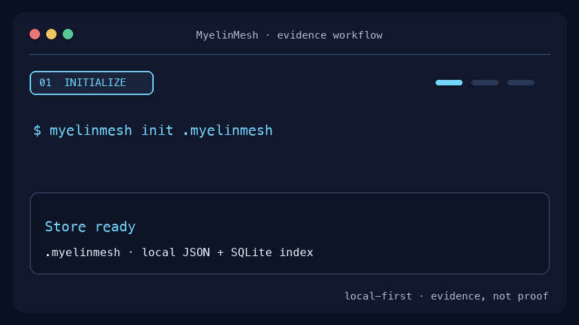

# MyelinMesh

[](https://github.com/askmy-stack/MyelinMesh/actions/workflows/ci.yml)
[](LICENSE)
[](pyproject.toml)
[](ROADMAP.md)

> **The reliability evidence mesh for AI systems.**

MyelinMesh is an open-source evidence layer that connects software and model changes, agent trajectories, physical tests, runtime incidents, diagnoses, recoveries, and human reviews into reusable reliability knowledge.

The name draws from biological **myelin**, which insulates and accelerates signals, and a **mesh**, which links evidence across otherwise isolated systems. MyelinMesh does not certify safety or prove causality. It preserves provenance, exposes uncertainty, and makes reliability claims testable.

<picture>
  <source media="(prefers-reduced-motion: reduce)" srcset="docs/assets/myelinmesh-cli-demo-static.png">
  
</picture>

<p align="center"><em>From fragmented reliability signals to searchable, provenance-aware evidence.</em></p>

<details>
<summary>Accessible text version of the demo</summary>

```console
$ myelinmesh init .myelinmesh
Initialized MyelinMesh store at .myelinmesh

$ myelinmesh ingest examples/records/tool-semantic-drift.mer.json --store .myelinmesh
Ingested mer-demo-tool-drift-001 into .myelinmesh

$ myelinmesh search "semantic drift" --store .myelinmesh
mer-demo-tool-drift-001 · tool-semantics · critical · confidence 0.91
```

</details>

## Why this exists

Reliability evidence is usually fragmented:

- Tool-interface changes live in compatibility reports.
- Agent failures live in traces and benchmark outputs.
- Robot regressions live in MCAP bags and simulation artifacts.
- Diagnoses live in incident documents.
- Recoveries live in code, runbooks, or human memory.

MyelinMesh gives these artifacts a shared record format and a local-first store so future tests and decisions can reuse what the system has already learned.

```text
Tool-Semantics ─┐
ImpactForge ─────┼──► MyelinMesh Evidence Records ─► search, compare, rank, reuse
Parallax ────────┤
ROS 2 / MCAP ────┤
OpenTelemetry ───┘
```

## Initial capabilities

- Versioned **MyelinMesh Evidence Record (MER)** schema.
- Deterministic validation and content hashing.
- Local evidence store backed by JSON files and SQLite metadata.
- CLI for initialization, validation, ingestion, search, inspection, and statistics.
- Adapters for Tool-Semantics, ImpactForge, and Parallax-style outputs.
- Example records covering tool drift, physical regression, and runtime recovery.
- JSON Schema export for non-Python producers.

## Quick start

```bash
python -m venv .venv
source .venv/bin/activate
pip install -e ".[dev]"

myelinmesh init .myelinmesh
myelinmesh validate examples/records/tool-semantic-drift.mer.json
myelinmesh ingest examples/records/tool-semantic-drift.mer.json --store .myelinmesh
myelinmesh list --store .myelinmesh
myelinmesh search "semantic drift" --store .myelinmesh
myelinmesh stats --store .myelinmesh
```

Run the demo dataset:

```bash
make demo
```

The demo creates an isolated `.myelinmesh-demo` store, ingests all three included evidence records, lists them, and prints aggregate statistics. It never writes outside the repository.

## CLI at a glance

| Command | Purpose |
| --- | --- |
| `myelinmesh init PATH` | Create a local evidence store and SQLite index. |
| `myelinmesh validate RECORD` | Validate an MER JSON document without ingesting it. |
| `myelinmesh ingest RECORD --store PATH` | Validate, hash, and persist evidence. |
| `myelinmesh list --store PATH` | List indexed evidence records. |
| `myelinmesh search QUERY --store PATH` | Search evidence using indexed text and metadata. |
| `myelinmesh show ID --store PATH` | Inspect one evidence record. |
| `myelinmesh stats --store PATH` | Summarize the local evidence collection. |
| `myelinmesh adapt PRODUCER REPORT` | Convert supported producer output into an MER record. |

## Example evidence record

```json
{
  "schema_version": "0.1.0",
  "identity": {
    "evidence_id": "mer-demo-tool-drift-001",
    "project": "tool-semantics",
    "captured_at": "2026-08-04T18:20:00Z"
  },
  "provenance": {
    "source_type": "simulation",
    "producer": "tool-semantics",
    "producer_version": "0.1.0",
    "commit_sha": "a71c22"
  },
  "context": {
    "domain": "agent",
    "system": "calendar-agent",
    "task": "schedule a meeting"
  },
  "failure": {
    "detected": true,
    "failure_class": "semantic_tool_drift",
    "severity": "critical",
    "confidence": 0.91
  },
  "validation": {
    "human_reviewed": true,
    "replay_count": 10,
    "reproduced_count": 9
  }
}
```

## Architecture

```text
Producers
  GitHub · Tool-Semantics · ImpactForge · Parallax · ROS 2 · OTel
                                │
                                ▼
                     Adapter and validation layer
                                │
                                ▼
                  MyelinMesh Evidence Record (MER)
                                │
              ┌─────────────────┴─────────────────┐
              ▼                                   ▼
        JSON artifact store                  SQLite index
              │                                   │
              └─────────────────┬─────────────────┘
                                ▼
                     CLI · SDK · future API
```

See [docs/architecture.md](docs/architecture.md) and [docs/evidence-model.md](docs/evidence-model.md).

## Relationship to the existing projects

- **Tool-Semantics** produces evidence about tool schemas, descriptions, selection behavior, side effects, and compatibility risk.
- **ImpactForge** produces evidence about change impact, selected physical tests, simulation metrics, and release decisions.
- **Parallax** produces semantic traces, early warnings, diagnoses, recovery attempts, and post-recovery outcomes.
- **MyelinMesh** connects those records without replacing the source systems.

## Trust boundaries

MyelinMesh records **evidence, not proof**. Every record carries provenance, uncertainty, validation context, and reproducibility signals so consumers can judge whether it applies to a new situation. Historical similarity must not be treated as causal certainty, safety certification, or an authorization to deploy. See the [evidence model](docs/evidence-model.md), [security and privacy guidance](docs/security-privacy.md), and [data governance policy](DATA_GOVERNANCE.md).

## Development

```bash
./scripts/bootstrap.sh
source .venv/bin/activate
./scripts/check.sh
```

You can also use the included dev container or Docker image:

```bash
docker compose build
docker compose run --rm myelinmesh --help
```

The repository ships with Ruff, mypy, pytest with branch coverage, pre-commit hooks, schema drift detection, multi-version CI, CodeQL, and Dependabot configuration.

Regenerate the README demo and its reduced-motion fallback with:

```bash
pip install -e ".[media]"
python scripts/render_readme_demo.py
```

## Non-goals

MyelinMesh is not:

- A safety certification authority.
- A generic log-management platform.
- An autonomous root-cause oracle.
- A replacement for MCAP, OpenTelemetry, or experiment tracking.
- A system that treats historical similarity as proof.

## Project status

The repository is at **Milestone 0: foundation**. The local schema, validation, storage, and adapter interfaces are usable. Production connectors, vector retrieval, benchmark datasets, and hosted operation remain roadmap work.

## Documentation

- [Project charter](PROJECT_CHARTER.md)
- [Roadmap](ROADMAP.md)
- [Research agenda](RESEARCH.md)
- [Architecture](docs/architecture.md)
- [Evidence model](docs/evidence-model.md)
- [Integration contracts](docs/integration-contracts.md)
- [Dataset strategy](docs/dataset-strategy.md)
- [Benchmark plan](docs/benchmark-plan.md)
- [Security and privacy](docs/security-privacy.md)
- [Brand and naming](docs/brand.md)
- [Name due diligence](docs/name-due-diligence.md)
- [Data governance](DATA_GOVERNANCE.md)
- [Start here](START_HERE.md)

## Contributing

Read [CONTRIBUTING.md](CONTRIBUTING.md), the [Code of Conduct](CODE_OF_CONDUCT.md), and the [governance model](GOVERNANCE.md). Small schema fixtures, adapters, provenance improvements, validation tests, and benchmark cases are excellent first contributions.

## License

Apache License 2.0. See [LICENSE](LICENSE).
